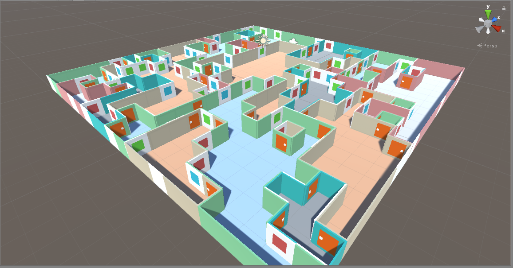
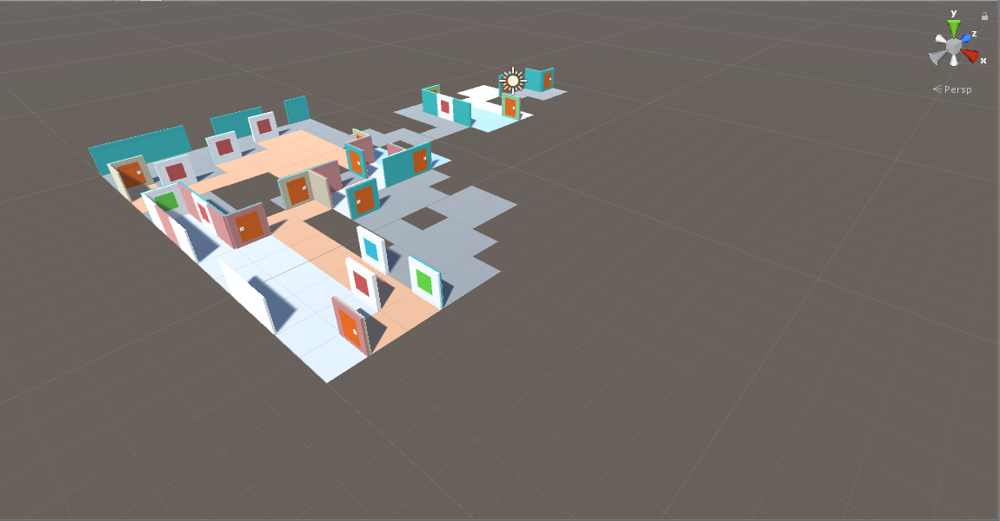
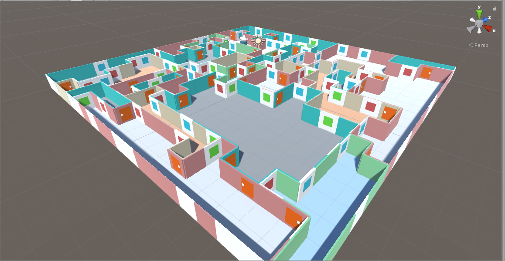

# Maze
Procedurally generated maze that generated halls and rooms in a 3D space.  It is created in Unity using C#.

In the progress of being made.  The code uses a time step so you can
see the how the rooms are and halls are being made.

